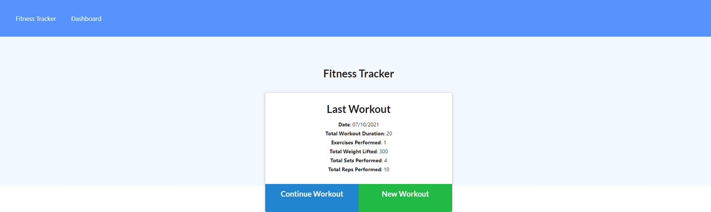
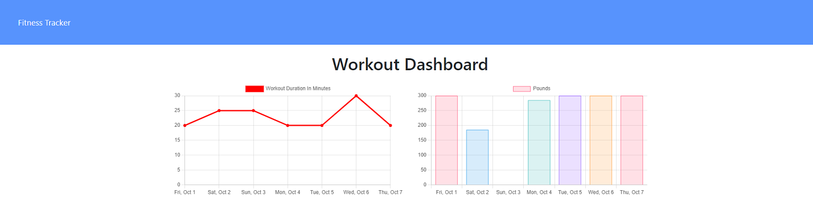

# Workout Tracker

## Description

A full stack web application to track your workouts, and your progress over time. Built using Node.js, Express, MongoDB, Mongoose and hosted on Heroku!

## Table of Contents

1.[Installation Instructions](#installation-instructions)

2.[Usage Instructions](#usage-instructions)

3.[Contribution Instructions](#contribution-instructions)

4.[Questions](#questions)

5.[License](#License)

## Installation Instructions

To install the project locally:

    npm install

You will also need to have MongoDB installed, instructions can be found here: https://www.mongodb.com/

## Usage Instructions

To seed the database run:

npm run seed

To start the server run:

npm run start

The server will be hosted at localhost:3000/ by default.

You can also view the project hosted live on [Heroku](https://riley-workout-tracker.herokuapp.com/)

Here are some screenshots of the project:

## Contribution Instructions

I am not actively maintaining this project. Please feel free to fork and make changes

## Questions

For any questions regarding the project please reach out to me on Github: [Github](https://github.com/rileylum) or via Email: rileylum@adam.com.au

## License

ISC License

Copyright (c) 2021, Riley Lum

Permission to use, copy, modify, and/or distribute this software for any
purpose with or without fee is hereby granted, provided that the above
copyright notice and this permission notice appear in all copies.

THE SOFTWARE IS PROVIDED "AS IS" AND THE AUTHOR DISCLAIMS ALL WARRANTIES
WITH REGARD TO THIS SOFTWARE INCLUDING ALL IMPLIED WARRANTIES OF
MERCHANTABILITY AND FITNESS. IN NO EVENT SHALL THE AUTHOR BE LIABLE FOR
ANY SPECIAL, DIRECT, INDIRECT, OR CONSEQUENTIAL DAMAGES OR ANY DAMAGES
WHATSOEVER RESULTING FROM LOSS OF USE, DATA OR PROFITS, WHETHER IN AN
ACTION OF CONTRACT, NEGLIGENCE OR OTHER TORTIOUS ACTION, ARISING OUT OF
OR IN CONNECTION WITH THE USE OR PERFORMANCE OF THIS SOFTWARE.
